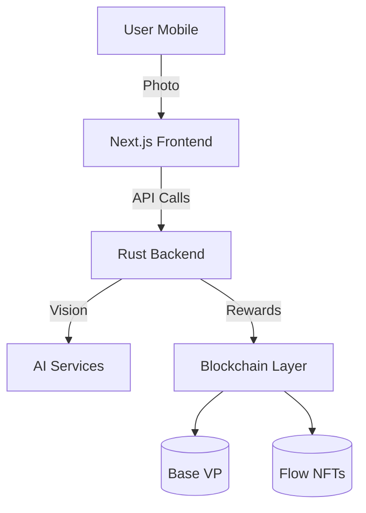

```markdown
# FitAgent – AI-Powered Nutrition Coach 🍎🤖

[](https://opensource.org/licenses/MIT)
[](https://www.python.org/)
[](https://docs.fetch.ai/agents-aea/uagent/)

> **Multi-chain, AI-driven nutrition tracking** that rewards healthy habits with Base VP rewards and Flow dynamic NFTs.

<p align="center">
  
</p>

## 🚀 Features

- **Instant Photo Analysis** - AI-powered nutrition tracking in <1s
- **Personalized Coaching** - AI-generated meal insights and goals
- **Web3 Rewards** - Earn Base VP and evolve Flow NFTs
- **Privacy-First** - Zero PII on-chain, encrypted health data

## 🛠 Tech Stack

| Component | Technology |
|-----------|------------|
| Frontend | Next.js 15, Tailwind CSS, shadcn/ui |
| Backend | Rust (Actix-web), uAgent Framework |
| AI/ML | Venice AI (qwen3-235b), Custom Vision Models |
| Blockchain | Base, Flow, LayerZero |
| Storage | Tableland, IPFS |

## 🏗 Architecture



## 🚀 Quick Start

1. **Prerequisites**
   ```bash
   # System Requirements
   Python 3.10+
   Node.js 18+
   Rust (latest stable)
   ```

2. **Install Dependencies**
   ```bash
   # Clone repository
   git clone https://github.com/ToXMon/fitagent.git
   cd fitagent
   
   # Install Python dependencies
   pip install -r requirements.txt
   
   # Install frontend dependencies
   cd frontend
   npm install
   ```

3. **Configure Environment**
   ```bash
   cp .env.example .env
   # Edit .env with your API keys
   ```

4. **Run Locally**
   ```bash
   # Start backend
   python agent.py
   
   # In a new terminal
   cd frontend
   npm run dev
   ```

## 🔗 Smart Contracts

### Base (VP Rewards)
```solidity
// Simplified VP reward logic
function completeGoal() external {
    Goal storage g = goals[msg.sender];
    uint256 vp = 50 + (g.streak * 5);
    g.streak++;
    _streamVP(msg.sender, vp);
}
```

### Flow (Dynamic NFTs)
```cadence
// NFT Evolution
pub resource NFT { 
    pub var level: EvolutionLevel
    pub fun evolve(to: EvolutionLevel, uri: String) {
        self.level = to
        self.imageURI = uri
    }
}
```

## 🤖 AI Integration

| Service | Model | Latency |
|---------|-------|---------|
| Vision | ViT-tiny | <600ms |
| Coaching | Venice AI (qwen3-235b) | ~1.2s |
| Artwork | AI Image Generation | ~2s |

## 📊 Data Model

```typescript
interface NutritionLog {
  userId: string;      // Hashed identifier
  timestamp: number;
  mealType: 'breakfast' | 'lunch' | 'dinner' | 'snack';
  nutrients: {
    calories: number;
    protein: number;
    carbs: number;
    fat: number;
  };
  imageHash: string;   // IPFS CID
}
```


